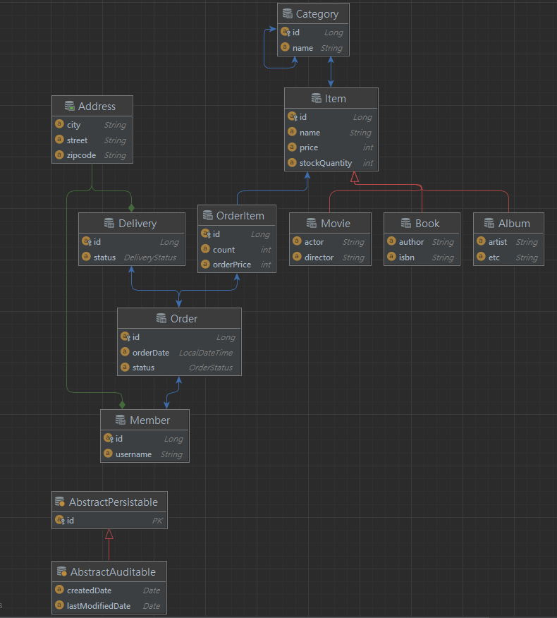

## JPA Web Applcation 

### 1. 요약

개인적으로 JPA를 공부하며 배운 내용을 정리하는 공간.

### 2. 기술 스펙

| Tech    | Version           |
|---------|-------------------|
| **JDK** | Java 11           |
| **F/W** | Spring Boot 2.5.11 |
| **DB**  | H2                |
| **ORM** | Hibernate         |

### 3. Diagram

### 4. 정리

- [[20220403] 엔티티설계](./document/20220403/엔티티설계/README.md)
- [[20220409] 애플리케이션 구현 준비](./document/20220409/애플리케이션_구현준비/README.md)
- [[20220409] 엔티티설계_주의사항](./document/20220409/엔티티설계_주의사항/README.md)
- [[20220409] 회원_도메인_개발](./document/20220409/회원_도메인_개발/README.md)
- [[20220416] 상품 도메인 개발](./document/20220416/상품_도메인_개발/README.md)
- [[20220419] 홈화면과_레이아웃](./document/20220419/홈화면과_레이아웃/README.md)
- [[20220421] 변경감지와_병합](./document/20220421/변경감지와_병합/README.md)

### 5. 참고 자료

- [[인프런] 스프링 부트와 JPA 활용 - 웹 애플리케이션 개발](https://www.inflearn.com/course/%EC%8A%A4%ED%94%84%EB%A7%81%EB%B6%80%ED%8A%B8-JPA-%ED%99%9C%EC%9A%A9-1/dashboard)
