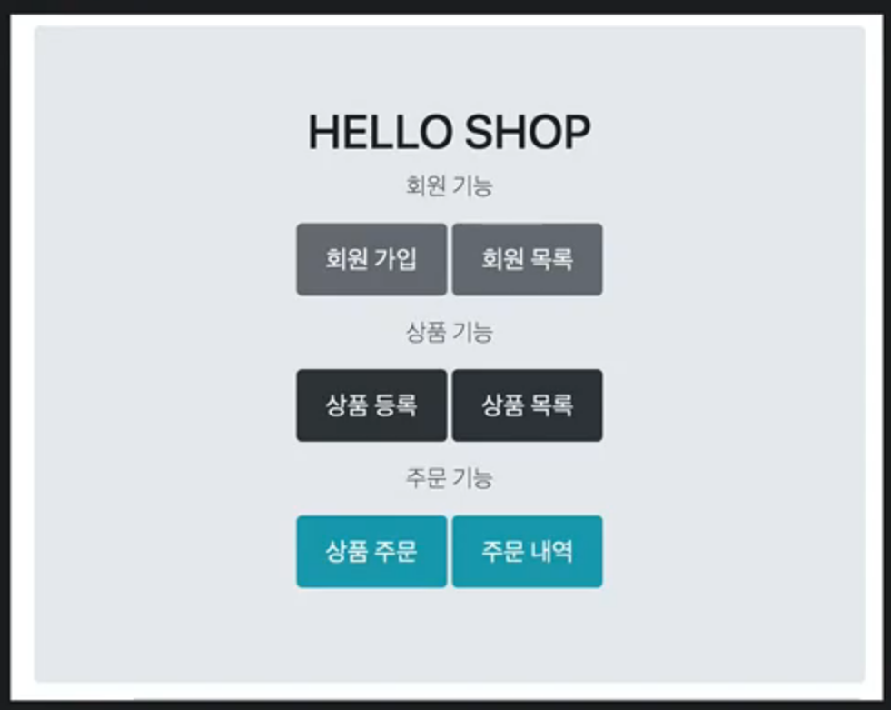
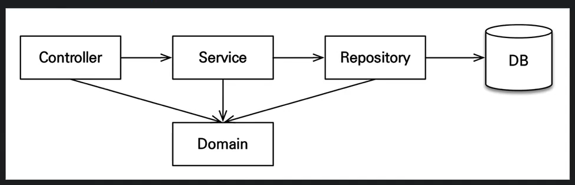

```
@date   : 2022-04-09 15:09
@author : ymkim
@desc   : 애플리케이션 구현 준비
```

## 01. 애플리케이션 구현 준비



- **회원 기능**
  - 회원 등록
  - 회원 조회
- **상품 기능**
  - 상품 등록
  - 상품 수정
  - 상품 조회
- **주문 기능**
  - 상품 주문
  - 주문 내역 조회
  - 주문 취소
- **예제를 단순화 하기 위해 다음 기능 구현 x**
  - 로그인과 권한 관리
  - 파라미터 검증과 예외 처리 단순화
  - 상품은 도서만 사용
  - 카테고리는 사용 x
  - 배송 정보는 사용 x

## 02. 애플리케이션 아키텍처



### 계층형 구조 사용

- **Controller, web** : 웹 계층
- **service** : 비즈니스 로직, 트랜잭션 처리
- **repository** : JPA를 직접 사용하는 계층, 엔티티 매니저 사용
- **domain** : 엔티티가 모여 있는 계층, 모든 계층에서 사용

### 패키지 구조

- domain
- exception
- repository
- service
- web

