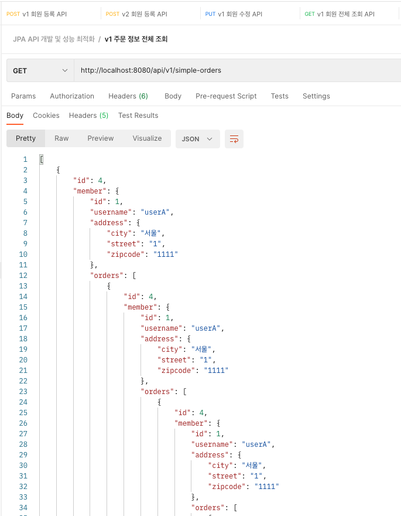

## 01. 지연 로딩과 조회 성능 최적화

- 주문 + 배송정보 + 회원을 조회하는 API를 만든다
- 지연 로딩으로 인해 발생하는 성능 문제를 단계별로 파악

### 01-1. 주문 정보 조회

xToOne은 기본 로딩 전략이 EAGER이다. 즉, xToOne 어노테이션을 사용하는 경우 로딩 전략을 LAZY로 지정을 해줘야 한다는 말이다. 이번에는 주문 + 배송 + 회원 정보를 조회하는 API를 생성 해보자.

```java
@RestController
@RequiredArgsConstructor
public class OrderSimpleAPIController {
    
    private final OrderRepository orderRepository;
    
    @GetMapping("/api/v1/order-simple")
    public List<Order> ordersV1() {
        List<Order> orders = orderRepository.findAllByString(new OrderSearch());
        return orders;
    }
}
```

주문 + 배송 + 회원 정보를 가져오기 위한 API ordersV1을 만들었다. 해당 코드를 간략히 설명하자면 orderRepository 참조 변수를
통해 회원의 주문 정보를 가져오는 상황이다. 그렇다면 현재 Order, Member, Delivery의 연관관계가 어떻게 설정이 되어 있는지 살펴보자.

```java
@Entity
public class Order {

    //...
    
    @ManyToOne(fetch = FetchType.LAZY)
    @JoinColumn(name = "member_id")
    public Member member;
    
    //...
    
}
```

```java
@Entity
public class Member {
    
    //...
    
    @OneToMany(mappedBy = "member")
    private List<Order> orders = new ArrayList<Order>();
    
    //...
}
```

```java
@Entity
public class Delivery {
    
    @OneToOne(mappedBy = "delivery", fetch = FetchType.LAZY)
    public Order order;
}
```

현재 Member와 Order 관계는 1 : N, Delivery와 Order의 관계는 1 : 1 인 상황이다.  
그렇다면, 위에서 findAllByString() 했을 경우 어떤 결과가 나오는지 살펴보자.

```java
@GetMapping("/api/v1/order-simple")
public List<Order> ordersV1() {
    List<Order> orders = orderRepository.findAllByString(new OrderSearch());
    return orders;
}
```

- 현재 이 부분을 의미하고 있다



회원, 주문, 배송 정보는 서로 연관관계를 형성하고 있으며 지연 로딩까지 설정이 되어 있기 때문에  
무한 루프에 빠지게 된다. 객체를 JSON으로 만드는 Jackson 라이브러리 입장에서 Member에도 Order가  
있고, Order에도 Member가 있기 때문에(양방향 연관관계의 문제) 이러한 문제가 발생한다.

> 그렇다면 이러한 상황을 어떻게 해결해야 할까?

엔티티를 직접 노출할 때는 양방향 연관관계 걸린 곳은 꼭 한 쪽을 @JsonIgnore으로 설정 해주어야 한다. 여기서 양방향
연관 관계란 Member -> Order, Order -> Member 가 가능하다는 의미다.

```java

// Member
@JsonIgnore
@OneToMany(mappedBy = "member")
private List<Order> orders = new ArrayList<>();

----

// OrderItem
@JsonIgnore
@ManyToOne(fetch = FetchType.LAZY)
@JoinColumn(name = "order_id")
private Order order;

----

// Delivery
@JsonIgnore
@OneToOne(mappedBy = "delivery", fetch = FetchType.LAZY)
private Order order;

```

- 양방향이 걸리는 부분은 @JsonIgnore를 통해 문제를 해결해야 한다

> 하지만 두 번째 문제가 발생한다.

```
"org.springframework.http.converter.HttpMessageConversionException: 
Type definition error: 
[simple type, class org.hibernate.proxy.pojo.bytebuddy.ByteBuddyInterceptor]; 
nested exception is com.fasterxml.jackson.databind.exc.InvalidDefinitionException: 
No serializer found for class org.hibernate.proxy.pojo.bytebuddy.ByteBuddyInterceptor and 
no properties discovered to create BeanSerializer
```

위와 같은 에러가 발생하는 이유는 Member의 로딩 전략은 LAZY 타입이기 때문이다. 
즉, 지연 로딩을 사용하는 경우 실제 객체를 가져오는 것이 아닌 프록시 객체를 가져오게 되는데,  
Jackson 라이브러리가 실 객체가 아닌 프록시 객체를 가져올 수 없기 때문에 위와 같은 예외가
발생하게 된다.

### Hibernate5Module 디팬던시 주입

**build.gradle**

```groovy
implementation 'com.fasterxml.jackson.datatype:jackson-datatype-hibernate5'
```

- 실제 해당 디팬던시를 사용할 경우는 적다.

**Application.java**

```java
@SpringBootApplication
public class Application {

	public static void main(String[] args) {
		SpringApplication.run(Application.class, args);
	}

//    @Bean
//    Hibernate5Module hibernate5Module() {
//        return new Hibernate5Module();
//    }

    @Bean
    Hibernate5Module hibernate5Module() {
        Hibernate5Module hibernate5Module = new Hibernate5Module();
        hibernate5Module.configure(Hibernate5Module.Feature.FORCE_LAZY_LOADING, true);
        return hibernate5Module;
    }
}
```

Hibernate5Module을 Bean으로 등록하여 지연 로딩인 데이터를 안 가져올 수 도 있고, 설정을 통해
지연 로딩 데이터를 한 번에 가져올 수도 있다.

```json
[
    {
        "id": 4,
        "member": {
            "id": 1,
            "username": "userA",
            "address": {
                "city": "서울",
                "street": "1",
                "zipcode": "1111"
            }
        },
        "orderItems": [
            {
                "id": 6,
                "item": {
                    "id": 2,
                    "name": "JPA1 BOOk",
                    "price": 10000,
                    "stockQuantity": 99,
                    "categories": [],
                    "author": null,
                    "isbn": null
                },
                "orderPrice": 10000,
                "count": 1,
                "totalPrice": 10000
            },
            {
                "id": 7,
                "item": {
                    "id": 3,
                    "name": "JPA2 BOOk",
                    "price": 20000,
                    "stockQuantity": 98,
                    "categories": [],
                    "author": null,
                    "isbn": null
                },
                "orderPrice": 20000,
                "count": 2,
                "totalPrice": 40000
            }
        ],
        "delivery": {
            "id": 5,
            "address": {
                "city": "서울",
                "street": "1",
                "zipcode": "1111"
            },
            "status": null
        },
        "orderDate": "2022-04-28T20:47:38.790091",
        "status": "ORDER",
        "totalPrice": 50000
    },
    {
        "id": 11,
        "member": {
            "id": 8,
            "username": "userB",
            "address": {
                "city": "부산",
                "street": "2",
                "zipcode": "2222"
            }
        },
        "orderItems": [
            {
                "id": 13,
                "item": {
                    "id": 9,
                    "name": "SPRING1 BOOK",
                    "price": 20000,
                    "stockQuantity": 197,
                    "categories": [],
                    "author": null,
                    "isbn": null
                },
                "orderPrice": 10000,
                "count": 3,
                "totalPrice": 30000
            },
            {
                "id": 14,
                "item": {
                    "id": 10,
                    "name": "SPRING2 BOOK",
                    "price": 40000,
                    "stockQuantity": 296,
                    "categories": [],
                    "author": null,
                    "isbn": null
                },
                "orderPrice": 20000,
                "count": 4,
                "totalPrice": 80000
            }
        ],
        "delivery": {
            "id": 12,
            "address": {
                "city": "부산",
                "street": "2",
                "zipcode": "2222"
            },
            "status": null
        },
        "orderDate": "2022-04-28T20:47:38.836524",
        "status": "ORDER",
        "totalPrice": 110000
    }
]
```

- 해당 옵션을 적용하는 경우, 위와 같은 데이터 결과를 얻을 수 있다
- 현재는 FORCE_LAZY_LOADING이기 때문에 LAZY로 설정이 되어도 데이터를 다 가져온다
- `즉, Entity를 외부로 직접 노출하지 말라는 의미다`
- 간단한 Application이 아닌 이상 Entity를 절대 API 응답으로 반환하면 안된다
    - 반환 할거면 DTO로 엔티티를 변환 한 후에 반환 해야 한다

### 정리

- 할 일
- 할 일